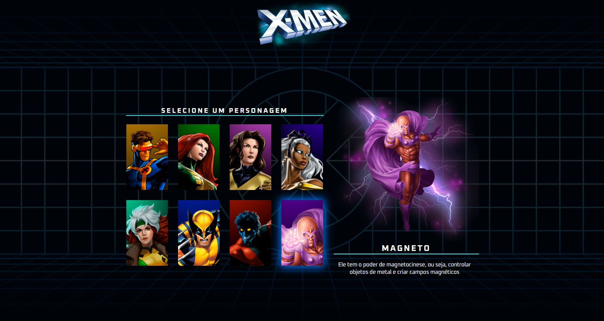

# Projeto X-MEN

  
### Primeira aula da semana, fui um pouco além e adicionei alguns estilos com CSS para ficar mais apresentável antes de subir para o GitHub
Apesar de já ter um bom conhecimento em HTML, CSS e JavaScript, gostei muito do projeto e da didática dos irmãos do Dev em Dobro, e nunca é demais praticar! Então, bora adicionar esse projetinho maneiro ao gitHub e os absorver mais conhecimentos em desenvolvimento frontend